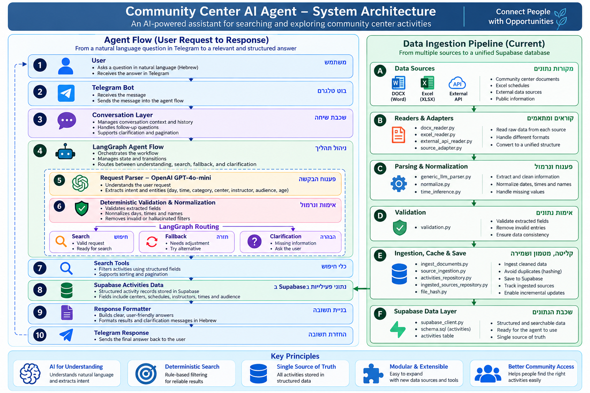

# Community Center AI Agent

סוכן AI חכם לחיפוש חוגים ופעילויות במרכזים קהילתיים באמצעות שפה טבעית בעברית.

המערכת מאפשרת למשתמש לשאול שאלות חופשיות דרך Telegram, להבין את כוונת החיפוש, לשמור הקשר בין הודעות, לסנן פעילויות לפי מספר פרמטרים ולהחזיר תשובות ברורות מתוך מאגר הפעילויות של המערכת.

הפרויקט משלב בין **LLM להבנת שפה טבעית** לבין **לוגיקה דטרמיניסטית לאימות, סינון ושליפת מידע**, כאשר LangGraph מנהל את זרימת העבודה ואת מצב השיחה של הסוכן.

---

## Current Status

המערכת כוללת כיום:

- ממשק Telegram
- חיפוש בשפה טבעית בעברית
- הבנת ניסוחים חופשיים ושגיאות כתיב סבירות
- שיחות המשך ושמירת הקשר
- זיכרון שיחה מתמשך באמצעות LangGraph ו-PostgreSQL
- סינון לפי יום, שעה, סוג פעילות, מרכז, מדריך, קהל יעד, גיל ועוד
- Clarification כאשר הבקשה אינה ברורה מספיק
- Fallback interpretation
- Pagination להצגת תוצאות נוספות
- Data Ingestion Pipeline
- תמיכה ב-DOCX וב-Excel
- Supabase Storage לניהול קובצי מקור
- סנכרון Add / Replace / Delete של קובצי מקור
- סנכרון אוטומטי של מקורות הנתונים
- ממשק Admin מקומי לניהול מקורות
- תמיכה במקור חיצוני מסוג Publuu
- Preview ו-Validation לפני שמירת נתוני מקור חיצוני
- תשתית למקור API חיצוני מובנה
- Automated Evaluation
- Data Validation

### Current Quality Results

הפרויקט כולל כלי Automated Evaluation ו-Data Validation שניתן להריץ מחדש בכל שלב.

מספר הפעילויות במערכת הוא דינמי, משום שמקורות נתונים יכולים להתווסף, להתחלף או להימחק דרך מנגנון הניהול והסנכרון.

---

# System Architecture



## Main System Flow

```text
User
  ↓
Telegram Bot
  ↓
Conversation Layer
  ↓
LangGraph Agent
  ↓
Persistent Conversation State
  ↓
Understand Request
  ↓
Request Parser
  ├── GPT-4o-mini Structured Output
  └── Deterministic Validation & Normalization
  ↓
Routing
  ├── Activity Search
  ├── Fallback
  └── Clarification
  ↓
Search Tools
  ↓
Supabase Activities Data
  ↓
Response Formatting
  ↓
Telegram Bot
  ↓
User
```

---

# Architecture Principle

המערכת מבוססת על עיקרון של:

## AI for Understanding + Deterministic Retrieval

ה-LLM משמש להבנת השפה והכוונה של המשתמש.

לעומת זאת, תוצאות הפעילויות אינן נוצרות באופן חופשי על ידי ה-LLM, אלא נשלפות באמצעות פונקציות חיפוש וסינון מתוך הנתונים הקיימים במערכת.

לדוגמה, בקשה כמו:

```text
אילו חוגי פילאטיס יש ביום שלישי בערב?
```

יכולה להפוך למבנה כגון:

```text
intent = activity
category = פילאטיס
day = שלישי
start_after = 17:00
start_before = 23:59
```

לאחר מכן Python מבצע Validation ו-Normalization, והפילטרים מועברים לשכבת החיפוש.

כך המערכת מפרידה בין ארבעה תפקידים מרכזיים:

```text
Natural Language Understanding
            ↓
Validation & Normalization
            ↓
Workflow Orchestration
            ↓
Deterministic Data Retrieval
```

### Why This Architecture?

ההפרדה מאפשרת לשלב בין:

- גמישות בהבנת שפה טבעית
- חיפוש מבוסס נתונים
- הפחתת hallucinations
- Workflow ברור
- תחזוקה קלה יותר
- אפשרות להוסיף יכולות חדשות בעתיד

---

# How a Request Is Processed

לדוגמה:

```text
User:
מה יש ביום שלישי בערב?
```

הבקשה עוברת את השלבים הבאים:

```text
1. Telegram receives the message

2. Conversation Layer checks the conversation context

3. LangGraph loads the persistent conversation state

4. Request Parser understands the request

5. GPT-4o-mini extracts structured information

6. Python validates and normalizes the extracted fields

7. LangGraph decides the next action

8. Search Tools apply the filters

9. Matching activities are returned from Supabase

10. The answer is formatted and sent back through Telegram
```

---

# Main Components

## 1. Telegram Bot

`agent/telegram_bot.py`

זהו ממשק המשתמש הראשי של המערכת.

ה-Bot מקבל הודעות מהמשתמש, מנהל את האינטראקציה ומציג את התוצאות.

הוא תומך ב:

- שאלות חופשיות בעברית
- כפתורי פעולה
- חיפוש חדש
- Follow-up questions
- שינוי פילטרים קיימים
- הסרת פילטרים
- Pagination
- הצגת תוצאות נוספות
- איפוס שיחה
- הודעות עזרה
- Greetings ו-Thanks
- הצגת מצב Typing בזמן עיבוד הבקשה
הקוד אינו נמצא בתוך Telegram.

ה-Bot רץ כתהליך Python, והספרייה `python-telegram-bot` מתקשרת עם Telegram Bot API ומעבירה את ההודעות ללוגיקת המערכת.

### Example Queries

```text
מה יש היום?

מה יש מחר בערב?

אילו חוגי פילאטיס יש ביום שלישי?

מה יש במרכז הדס?

אילו חוגים משה מעביר?

אילו חוגים מתאימים לגיל 16?
```

---

## 2. Conversation Layer

`agent/conversation.py`

שכבת השיחה אחראית להבנת הקשר השיחה ולקביעה כיצד הודעה חדשה קשורה למידע שכבר נשמר ב-State.

השכבה עובדת יחד עם `agent/graph.py`, `agent/request_parser.py` ו-`agent/state.py`.

לדוגמה:

```text
User:
אילו חוגי פילאטיס יש ביום שלישי בערב?

User:
ומה בבוקר?
```

המערכת מבינה שהשאלה השנייה היא המשך של החיפוש הקודם ושומרת את המידע הרלוונטי.

השכבה מטפלת בין היתר ב:

- New Query
- Follow-up
- More Results
- Clear Filters
- Known Filters
- New Search
- Greeting
- Thanks
- Unclear Messages
- Pagination

הזיכרון המרכזי של השיחה אינו נשמר רק בתוך Telegram.

ה-State נשמר באמצעות LangGraph Checkpointer מסוג `PostgresSaver`, המחובר ל-PostgreSQL דרך `DATABASE_URL`.

כך ניתן לשמור את מצב השיחה בין הודעות וגם לאחר הפעלה מחדש של ה-Bot.

---

## 3. LangGraph Agent

`agent/graph.py`

LangGraph מנהל את ה-Workflow המרכזי של הסוכן.

במקום לכתוב את כל תהליך העבודה כפונקציה אחת ארוכה, המערכת מחלקת אותו ל-Nodes ולמסלולים.

הזרימה המרכזית היא:

```text
START
  ↓
prepare_conversation_request
  ↓
understand_request
  ↓
route_after_understanding
  ├── activity_node
  ├── fallback_node
  └── clarification_node

fallback_node
  ↓
route_after_fallback
  ├── activity_node
  └── clarification_node

activity_node
  ↓
END

clarification_node
  ↓
END
```

LangGraph אחראי להחליט מה הצעד הבא בהתאם ל-State הנוכחי של הסוכן.

הגרף נקמפל עם `PostgresSaver`, ולכן מצב השיחה נשמר בצורה מתמשכת לפי `thread_id`.

המערכת כוללת גם אפשרות למחיקת thread שמור לצורך Reset אמיתי של השיחה.

---

## 4. Request Parser

`agent/request_parser.py`

ה-Request Parser אחראי להפוך שפה טבעית למידע מובנה.

המערכת משתמשת ב:

```text
OpenAI GPT-4o-mini
+
Structured Output
```

כדי לחלץ שדות כגון:

```text
intent
age
category
target_audience
day
start_after
start_before
location
center_name
branch
instructor
```

לדוגמה:

```text
אני רוצה משהו ביום רבעי בבקר לגברים
```

יכול להיות מובן כ:

```text
day = רביעי
start_after = 06:00
start_before = 12:00
target_audience = גם לגברים
```

גם כאשר קיימות שגיאות כתיב סבירות.

---

## 5. Deterministic Validation & Normalization

אחרי שה-LLM מחלץ את המידע, Python מפעיל שכבת בדיקה נוספת.

השכבה כוללת בין היתר:

- Time normalization
- Relative day handling
- Day validation
- Target audience normalization
- Field validation
- Hallucination cleanup
- Spelling-related normalization
- בדיקת ערכים לא תקינים
- הסרת פילטרים שהתווספו בצורה שגויה

לדוגמה, אם מודל השפה מפרש ערך מסוים גם כמרכז וגם כמיקום, שכבת ה-validation יכולה לזהות את הסתירה ולהסיר את הפילטר השגוי.

העיקרון הוא:

```text
LLM understands meaning
        ↓
Python verifies structure
```

---

## 6. Agent State

`agent/state.py`

AgentState מגדיר את מבנה המידע שעובר בין ה-Nodes של LangGraph.

ה-State כולל מידע כגון:

- User message
- Intent
- Interpretation confidence
- Category
- Day
- Time range
- Center
- Instructor
- Audience
- Age
- Search results
- Clarification state
- Conversation action
- Query fragment
- Clear fields
- Pagination state
- Final answer

כך כל Node מקבל את המידע שכבר נאסף ויכול להמשיך ממנו.

ה-State נשמר לאורך השיחה באמצעות הזיכרון המתמשך של LangGraph.

---

## 7. Search Tools

`agent/tools.py`

שכבת הכלים אחראית לחיפוש בפועל.

הפעילויות נטענות מ-Supabase באמצעות `database/activities_repository.py`, והחיפוש עצמו הוא דטרמיניסטי ומתבצע ב-Python באמצעות פילטרים מובנים.

ניתן לסנן לפי:

- Category
- Day
- Start time
- Center
- Branch
- Instructor
- Location
- Target audience
- Age

לדוגמה:

```text
day = שלישי
category = פילאטיס
start_after = 17:00
```

שכבת החיפוש תחזיר רק פעילויות שמתאימות לתנאים.

בנוסף היא מטפלת ב:

- Filtering
- Matching
- Sorting
- Pagination
- Age matching
- Result formatting

---

# Data Ingestion Pipeline

עיבוד הנתונים מתבצע בשכבה נפרדת מה-Agent.

המערכת תומכת במספר מקורות נתונים וממירה את כולם למבנה Activity אחיד לפני השמירה ב-Supabase.

```text
DOCX
  ↓
AI DOCX Parser
  ↓
Generic LLM Parser
  ↓
Deterministic Validation
  ↓
Activities


Excel
  ↓
Excel Reader
  ↓
Source Adapter
  ↓
Source Ingestion
  ↓
Validation & Deduplication


External Structured API
  ↓
External API Reader
  ↓
Source Adapter
  ↓
Source Ingestion
  ↓
Validation & Deduplication


Publuu External Source
  ↓
Publuu Reader
  ↓
AI Activity Extraction
  ↓
Preview
  ↓
Validation
  ↓
Activities


All Sources
  ↓
Activities Repository
  ↓
Supabase
```

ה-Agent אינו קורא מחדש את קובצי המקור בזמן חיפוש.

ה-Agent גם אינו קורא את Publuu בזמן שאלת משתמש.

לאחר שלב ה-Ingestion הפעילויות נשמרות במבנה אחיד ב-Supabase, וה-Agent עובד מול הנתונים שכבר נשמרו.

---

## Document Reader

`ingestion/readers/docx_reader.py`

אחראי לקריאת תוכן מקבצי DOCX ולהפיכתו למבנה שניתן לעיבוד.

---

## AI DOCX Parser

`ingestion/ai_docx_parser.py`

מסמכי DOCX עוברים כיום במסלול AI-first.

הקובץ מפעיל את:

```text
ingestion/generic_llm_parser.py
```

לצורך חילוץ סמנטי של הפעילויות.

לאחר החילוץ התוצאה עוברת:

```text
ingestion/validation.py
```

ורק תוצאה תקינה ממשיכה בתהליך הקליטה.

```text
DOCX
  ↓
ai_docx_parser.py
  ↓
generic_llm_parser.py
  ↓
Validation
  ↓
Valid Activities
```

המסלול הנוכחי החליף את המבנה הישן של שישה Parsers דטרמיניסטיים נפרדים.

---

## Excel Reader

`ingestion/readers/excel_reader.py`

אחראי לקריאת קובצי Excel.

כל שורה בקובץ הופכת לרשומה ומועברת ל-`ingestion/source_adapter.py`, שממיר אותה למבנה Activity האחיד של המערכת.

המערכת יכולה להשתמש בגיליון שנבחר באמצעות `--sheet`, בגיליון בשם `activities` אם הוא קיים, או בגיליון הראשון בקובץ.

---

## External API Reader

`ingestion/readers/external_api_reader.py`

מספק תשתית לקריאת נתונים מובנים ממקור API חיצוני המחזיר JSON.

הקורא תומך במבנה של רשימה ישירה או ברשומות הנמצאות תחת שדות נפוצים כגון:

```text
activities
data
results
items
```

בשלב הנוכחי מדובר בתשתית כללית למקור חיצוני ולא בחיבור פעיל לשירות מסוים.

---

## Source Adapter

`ingestion/source_adapter.py`

אחראי להתאים רשומות שמגיעות ממקורות מובנים שונים למבנה Activity האחיד של המערכת.

הוא מזהה שמות שדות חלופיים, מנרמל ערכים ומשתמש בשכבות ה-Normalization וה-Time Inference הקיימות.

---

## Source Ingestion

`ingestion/source_ingestion.py`

מרכז את קליטת מקורות הנתונים המובנים הנוספים.

השכבה אחראית על:

- קריאת הנתונים
- Validation
- הסרת רשומות לא תקינות
- Deduplication
- החזרת רשימת Activities אחידה למסלול הראשי

---

## Normalization

`ingestion/normalize.py`

אחראי להפוך רשומות שונות למבנה אחיד שניתן לחיפוש.

---

## Time Inference

`ingestion/time_inference.py`

מטפל בהסקה ונרמול של מידע הקשור לשעות כאשר מבנה המקור אינו אחיד.

---

## Ingestion Runner

`ingestion/ingest_documents.py`

משמש כבקר הראשי של תהליך ה-Ingestion.

הוא יכול:

- לעבד את קובצי המקור מתוך Supabase Storage

- לקבל קובץ DOCX יחיד
- לקבל קובץ Excel
- לקבל כתובת של מקור API חיצוני מובנה

כל מקור מועבר למסלול המתאים לו ולאחר מכן הפעילויות מוחזרות במבנה Activity אחיד.

ברירת המחדל היא Dry Run.

בעת שימוש ב-`--save`, פעילויות חדשות נשמרות ישירות ב-Supabase דרך `database/activities_repository.py` תוך מניעת כפילויות.
---

# Source Storage and Synchronization

`ingestion/storage_source.py`

אחראי לקריאת קובצי המקור מתוך Supabase Storage.

הקובץ:

- קורא את שם ה-Bucket מתוך `SOURCE_BUCKET`
- מאתר קובצי מקור נתמכים
- מוריד אותם זמנית לצורך עיבוד

סוגי הקבצים הנתמכים:

```text
.docx
.xlsx
.xlsm
```

`ingestion/storage_sync.py`

אחראי לזהות שינויים בקובצי המקור.

הוא משווה בין הקבצים שנמצאים ב-Storage לבין המקורות שכבר עובדו ומזהה:

```text
added
replaced
deleted
unchanged
```

קובץ חדש מתווסף למערכת.

קובץ שהוחלף מעובד מחדש ומחליף את הרשומות הקודמות שלו.

קובץ שנמחק גורם למחיקת הפעילויות ששויכו אליו.

במקרה של כשל במהלך Replace, הקוד מנסה לשחזר את הנתונים הקודמים.

`ingestion/storage_watcher.py`

מפעיל את אותו תהליך סנכרון באופן מחזורי ברקע.

ברירת המחדל היא בדיקה כל 60 שניות.

---

# Admin Interface

`admin/app.py`

המערכת כוללת ממשק ניהול מקומי מבוסס Flask.

הממשק מאפשר למנהל:

- Login

- לראות את קובצי המקור

- Upload

- Download

- Replace

- Delete

- לנהל מקורות חיצוניים

- לבדוק מקור חיצוני

- לראות Preview לפני שמירה

- לערוך נתונים שחולצו לפני Save

הקבצים של הממשק הם:

```text
admin/app.py
admin/templates/login.html
admin/templates/index.html
admin/templates/external_preview.html
```

הממשק פועל בנפרד מממשק התושב ב-Telegram.

כך לוגיקת ניהול הנתונים אינה מעורבת בלוגיקת החיפוש של המשתמש.

---

# Publuu External Source

המערכת כוללת גם מסלול לקריאת מקור ציבורי חיצוני מסוג Publuu.

הקבצים המרכזיים הם:

```text
ingestion/readers/publuu_reader.py
ingestion/readers/publuu_activity_extractor.py
database/external_sources_repository.py
admin/templates/external_preview.html
```

הזרימה היא:

```text
Publuu URL
  ↓
Publuu Reader
  ↓
Publication Content
  ↓
AI Activity Extraction
  ↓
Preview
  ↓
Admin Review
  ↓
Validation
  ↓
Activities Repository
  ↓
Supabase
```

המטרה של המסלול היא להוכיח שהמערכת יכולה לקרוא מידע גם ממקור חיצוני שאינו קובץ מקומי.

ה-Publuu אינו מקור שה-Agent קורא בזמן חיפוש.

לאחר שמירת הפעילויות, הן הופכות לחלק מטבלת `activities` ונשלפות בדיוק כמו יתר הפעילויות.

---

# Project Structure

```text
community-center-ai-agent/

│

├── admin/

│   ├── __init__.py

│   ├── app.py

│   └── templates/

│       ├── external_preview.html

│       ├── index.html

│       └── login.html

│

├── agent/

│   ├── conversation.py

│   │   └── Conversation context and follow-up logic

│

│   ├── evaluation_cases.json

│   │   └── Automated evaluation scenarios

│

│   ├── graph.py

│   │   └── LangGraph workflow, routing and persistent memory

│

│   ├── request_parser.py

│   │   └── Natural-language understanding and parsing

│

│   ├── run_evaluation.py

│   │   └── Evaluation runner

│

│   ├── state.py

│   │   └── LangGraph state definition

│

│   ├── telegram_bot.py

│   │   └── Telegram interface

│

│   ├── tools.py

│   │   └── Search, filtering and result formatting

│

│   └── validate_data.py

│       └── Data-validation checks

│

├── data/

│   └── raw/

│       ├── lecturer_samples/

│       │   ├── 01_מרכז_ספורט_הדס_בסיסי.docx

│       │   ├── 02_מרכז_ספורט_אלונים_טבלה.docx

│       │   ├── 03_מרכז_כושר_נופים_מלוכלך.docx

│       │   ├── 04_Neve_Sport_Center_bilingual.docx

│       │   ├── 05_מרכז_ספורט_מעיין_לפי_חוג.docx

│       │   └── 06_מרכז_ספורט_גלים_מקרי_קצה.docx

│       │

│       └── synthetic/

│           ├── community_center_booklet.docx

│           └── community_center_data.xlsx

│

├── database/

│   ├── __init__.py

│

│   ├── activities_repository.py

│   │   └── Activity reads, inserts and deletion

│

│   ├── external_sources_repository.py

│   │   └── External-source management

│

│   ├── ingested_sources_repository.py

│   │   └── Processed-source tracking

│

│   ├── schema.sql

│   │   └── Supabase table schemas

│

│   └── supabase_client.py

│       └── Supabase connection

│

├── docs/

│   ├── architecture.png

│   ├── langgraph_flow.png

│   └── system_map.png

│

├── ingestion/

│   ├── ai_docx_parser.py

│   │   └── AI-first DOCX parsing

│

│   ├── file_hash.py

│   │   └── Source content hashing

│

│   ├── generic_llm_parser.py

│   │   └── Semantic DOCX extraction

│

│   ├── ingest_documents.py

│   │   └── Main ingestion controller

│

│   ├── normalize.py

│   │   └── Data normalization

│

│   ├── source_adapter.py

│   │   └── Unified activity mapping for structured sources

│

│   ├── source_ingestion.py

│   │   └── Structured-source ingestion and deduplication

│

│   ├── storage_source.py

│   │   └── Supabase Storage source access

│

│   ├── storage_sync.py

│   │   └── Add, replace and delete synchronization

│

│   ├── storage_watcher.py

│   │   └── Automatic storage synchronization

│

│   ├── test_ai_docx_parser.py

│   │   └── AI DOCX parser test

│

│   ├── time_inference.py

│   │   └── Time normalization and inference

│

│   ├── validation.py

│   │   └── Activity validation

│

│   └── readers/

│       ├── docx_reader.py

│       ├── excel_reader.py

│       ├── external_api_reader.py

│       ├── publuu_activity_extractor.py

│       └── publuu_reader.py

│

├── .env.example

├── .gitignore

├── README.md

└── requirements.txt
```

> Generated folders such as `__pycache__` are intentionally omitted from the structure above.

>
> The local `.env` file is also intentionally omitted because it contains sensitive environment variables and is not committed to Git.

---

# Technologies

המערכת משתמשת בטכנולוגיות הבאות:

| Technology | Purpose |
|---|---|
| Python | Core application logic |
| OpenAI GPT-4o-mini | Natural-language understanding and extraction |
| LangChain OpenAI | OpenAI model integration |
| LangGraph | Agent workflow orchestration |
| LangGraph Postgres Checkpointer | Persistent conversation memory |
| PostgreSQL / psycopg | LangGraph checkpoint storage |
| Pydantic | Structured output and validation |
| python-telegram-bot | Telegram interface |
| Flask | Local Admin interface |
| python-dotenv | Environment-variable management |
| pandas | Data processing |
| openpyxl | Excel processing |
| python-docx | DOCX processing |
| PyMuPDF | PDF and publication-page processing |
| Supabase / PostgreSQL | Active activity database and structured storage |
| Supabase Storage | Source-file storage |

---

# Installation

## 1. Clone the Repository

```bash
git clone https://github.com/HibaKurdieh/community-center-ai-agent.git

cd community-center-ai-agent
```

## 2. Install Dependencies

```bash
pip install -r requirements.txt
```

---

# Environment Variables

המערכת משתמשת במשתני סביבה עבור מידע רגיש.

יש ליצור קובץ:

```text
.env
```

ניתן להשתמש ב:

```text
.env.example
```

כתבנית.

```env
OPENAI_API_KEY=
TELEGRAM_BOT_TOKEN=
SUPABASE_URL=
SUPABASE_SECRET_KEY=
EXTERNAL_API_KEY=
DATABASE_URL=
SOURCE_BUCKET=
ADMIN_PASSWORD=
ADMIN_SESSION_SECRET=
```

לאחר מכן יש להזין את הערכים המתאימים בקובץ `.env` המקומי.

`EXTERNAL_API_KEY` נדרש רק כאשר המקור החיצוני שבו משתמשים דורש מפתח גישה.

`DATABASE_URL` משמש את LangGraph לצורך Persistent Checkpoints.

`SOURCE_BUCKET` מגדיר את מאגר קובצי המקור ב-Supabase Storage.

`ADMIN_PASSWORD` ו-`ADMIN_SESSION_SECRET` משמשים לממשק הניהול המקומי.

> `.env` אינו מועלה ל-Git.

---

# Running the System

## Telegram Bot

מתיקיית השורש של הפרויקט:

```bash
python -m agent.telegram_bot
```

לאחר ההפעלה ניתן לפתוח את ה-Bot ב-Telegram ולשלוח שאלות בעברית.

---

## Admin Interface

להפעלת ממשק הניהול:

```bash
python -m admin.app
```

לאחר מכן ניתן לפתוח:

```text
http://127.0.0.1:5000
```

---

## Storage Synchronization

לבדיקת שינויים בלבד:

```bash
python -m ingestion.storage_sync
```

לביצוע Add / Replace / Delete בפועל:

```bash
python -m ingestion.storage_sync --apply
```

---

## Data Ingestion

כדי להריץ את תהליך ה-Ingestion במצב Dry Run על קובצי המקור שב-Supabase Storage:

```bash
python -m ingestion.ingest_documents
```

כדי לעבד קובץ DOCX חיצוני יחיד:

```bash
python -m ingestion.ingest_documents --file "path/to/file.docx"
```

כדי לעבד קובץ Excel:

```bash
python -m ingestion.ingest_documents --file "path/to/file.xlsx"
```

ניתן להעביר שם מרכז כברירת מחדל:

```bash
python -m ingestion.ingest_documents --file "path/to/file.xlsx" --center-name "מרכז קהילתי"
```

ניתן לבחור גיליון מסוים:

```bash
python -m ingestion.ingest_documents --file "path/to/file.xlsx" --sheet "activities"
```

כדי לקרוא נתונים ממקור API חיצוני מובנה:

```bash
python -m ingestion.ingest_documents --api-url "https://example.com/api/activities"
```

אם המקור החיצוני דורש מפתח גישה, ניתן לשמור אותו במשתנה הסביבה `EXTERNAL_API_KEY`.

לשמירה ישירה של פעילויות חדשות ב-Supabase:

```bash
python -m ingestion.ingest_documents --save
```

ניתן להשתמש ב-`--save` גם יחד עם מקור יחיד, לדוגמה:

```bash
python -m ingestion.ingest_documents --file "path/to/file.xlsx" --save
```

---

# Automated Evaluation

הפרויקט כולל מערכת Evaluation אוטומטית.

קובצי ההערכה:

```text
agent/evaluation_cases.json

agent/run_evaluation.py
```

להרצה:

```bash
python -m agent.run_evaluation
```

ה-Evaluation בודק בין היתר:

- Categories
- Days
- Time ranges
- Centers
- Instructors
- Target audience
- Age
- Natural Hebrew phrasing
- Spelling mistakes
- Vague requests
- Clarification behavior
- Conversation behavior

### Current Result

יש להריץ את ה-Evaluation מחדש כדי לקבל תוצאה עדכנית עבור הגרסה הנוכחית של המערכת.

---

# Data Validation

בנוסף לבדיקת התנהגות ה-Agent, קיימת בדיקה נפרדת של איכות הנתונים.

להרצה:

```bash
python -m agent.validate_data
```

הבדיקה כוללת:

- Required fields
- Day validation
- Time validation
- Age-range validation
- Duplicate detection
- Missing optional information
- Invalid values

### Current Result

יש להריץ את Data Validation מחדש כדי לקבל תוצאה עדכנית בהתאם למקורות הפעילים ב-Supabase.

ה-Warnings הם מידע לא קריטי ואינם נחשבים בהכרח לכשל של ה-Dataset.

---

# Example Conversation

```text
User:
אילו חוגי פילאטיס יש ביום שלישי בערב?

Agent:
[matching Pilates activities]

User:
ומה בבוקר?

Agent:
[Tuesday morning Pilates activities]

User:
ומה במרכז מעיין?

Agent:
[results filtered according to the updated context]
```

הדוגמה ממחישה שהמערכת אינה מתייחסת לכל הודעה כחיפוש חדש, אלא יכולה לשמור ולעדכן את הקשר השיחה.

---

# Supported Search Filters

המערכת תומכת כיום בפילטרים הבאים:

| Filter | Example |
|---|---|
| Category | פילאטיס |
| Day | שלישי |
| Time | ערב / אחרי 18:00 |
| Center | מעיין |
| Branch | סניף |
| Instructor | משה |
| Location | סטודיו |
| Target Audience | נשים / גם לגברים |
| Age | גיל 16 |

ניתן לשלב מספר פילטרים באותה בקשה.

לדוגמה:

```text
אילו חוגים יש ביום שלישי בערב לגיל 16?
```

---

# Handling Unclear Requests

כאשר בקשת המשתמש כללית מדי, המערכת אינה ממציאה פילטרים.

לדוגמה:

```text
אני מחפש חוג
```

במקום לבצע חיפוש שרירותי, LangGraph יכול להעביר את הבקשה למסלול Clarification.

```text
Request
   ↓
Understanding
   ↓
Not enough information
   ↓
Fallback
   ↓
Clarification
```

מידע שכן הובן נשמר ב-State ולא הולך לאיבוד.

---

# Handling Missing Data

לא בכל הרשומות קיימים כל השדות.

לכן המערכת מבדילה בין:

```text
MATCH
NO MATCH
UNKNOWN
```

לדוגמה, בחיפוש לפי גיל:

- פעילות עם טווח גיל מתאים יכולה לקבל `MATCH`
- פעילות עם טווח גיל לא מתאים מקבלת `NO MATCH`
- פעילות ללא מידע מספיק על גיל יכולה להישאר `UNKNOWN`

כך המערכת אינה הופכת מידע חסר לעובדה.

---

# Design Goals

## Reliability

המידע שמוחזר למשתמש מבוסס על תוצאות חיפוש מתוך הנתונים הקיימים.

## Natural Interaction

המשתמש יכול לכתוב בשפה טבעית ולא חייב להשתמש בפקודות קבועות.

## Context Awareness

ניתן להמשיך חיפוש קיים ולשנות רק חלק מהפילטרים.

## Persistent Memory

מצב השיחה נשמר באמצעות LangGraph ו-PostgreSQL ואינו תלוי רק בזיכרון הזמני של תהליך Telegram.

## Deterministic Retrieval

לאחר הבנת הבקשה, החיפוש עצמו מתבצע באמצעות לוגיקה דטרמיניסטית.

## Modularity

שכבות המערכת מופרדות:

```text
Interface
Conversation
Agent Workflow
Language Understanding
Search
Data
Ingestion
Administration
Evaluation
```

הפרדה זו מאפשרת לחבר בעתיד ממשק אחר, כגון WhatsApp או Web, בלי לשנות את לוגיקת החיפוש המרכזית.

## Extensibility

המערכת בנויה כך שניתן להוסיף בעתיד מקורות מידע, כלי חיפוש ויכולות נוספות בלי לשנות את כל הארכיטקטורה.

---

# Current Scope

המערכת הנוכחית מתמקדת ב:

> **Conversational search over structured community-center activity data.**

היא נועדה לענות על שאלות הקשורות לפעילויות שהמערכת מכירה, ולא לשמש כמנוע ידע כללי.

---

# Known Limitations

בשלב הנוכחי:

- חלק מהשדות אינם מלאים בכל הרשומות
- מידע על גיל אינו קיים בכל הפעילויות
- התוצאות תלויות במידע שקיים במאגר
- זמני התגובה תלויים גם בקריאות למודל השפה
- המערכת פועלת כיום בתחום החיפוש של פעילויות
- החיבור למקור API חיצוני הוא תשתית כללית ותלוי במבנה ובאימות של השירות החיצוני
- ממשק ה-Admin פועל כיום באופן מקומי
- מסלול Publuu הוא מסלול הדגמה לקריאת מקור ציבורי חיצוני ולא מקור הנתונים הראשי
- חילוץ ממקורות מבוססי תמונה דורש Review ו-Validation לפני שמירה

המערכת מטפלת במידע חסר בצורה מפורשת ואינה ממציאה ערכים שאינם ידועים.

---

# Future Work

כיווני הרחבה אפשריים:

- הוספת Regression Tests נוספים
- Structured Logging
- שיפור Observability
- הוספת Feedback מהמשתמש
- הרחבת יכולות החיפוש
- Refactoring של רכיבים גדולים למודולים קטנים יותר
- שיפור זמני תגובה
- הרחבת Data Validation
- תמיכה בשפות נוספות
- חיבור לספקי מידע חיצוניים נוספים
- חיבור ערוצי תקשורת נוספים
- Deployment לסביבת Production

---

# English Summary

**Community Center AI Agent** is a conversational AI system for searching structured community-center activity data in Hebrew.

The system combines:

- OpenAI GPT-4o-mini for natural-language understanding
- Deterministic Python validation and normalization
- LangGraph for workflow orchestration
- LangGraph Postgres Checkpointer for persistent conversation memory
- Structured search tools for activity retrieval
- Supabase / PostgreSQL as the active activity database
- Supabase Storage for source-file management
- Telegram for conversational interaction

- Flask for the local Admin interface

The agent supports follow-up questions, persistent context preservation, clarification, spelling variations, multiple search filters and pagination.

The project contains a multi-source ingestion architecture supporting DOCX documents and Excel files, together with a generic foundation for structured external APIs.

DOCX documents currently use an AI-first semantic extraction path through `ai_docx_parser.py` and `generic_llm_parser.py`, followed by deterministic validation.

Excel and structured external API records are adapted to the same Activity schema before validation, deduplication and storage in Supabase.

Source files can be managed through Supabase Storage, with Add / Replace / Delete synchronization and an automatic background watcher.

The project also includes a local Admin interface for managing source files and external sources.

A Publuu-based external-source flow demonstrates the ability to read information from a public external source, extract activities from publication pages, review them in a Preview screen and validate them before storing them in Supabase.

The resident-facing Agent does not read Publuu or source files at query time. It searches only the structured activity data already stored in Supabase.

The project also includes automated agent evaluation and data-validation tools.

The architecture is modular and designed so that additional data sources, communication channels, tools and AI capabilities can be integrated in future versions without redesigning the entire system.