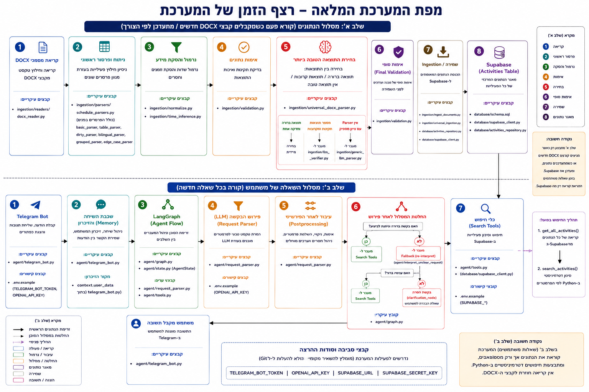

# Community Center AI Agent

סוכן AI חכם לחיפוש חוגים ופעילויות במרכזים קהילתיים באמצעות שפה טבעית בעברית.

המערכת מאפשרת למשתמש לשאול שאלות חופשיות דרך Telegram, להבין את כוונת החיפוש, לשמור הקשר בין הודעות, לסנן פעילויות לפי מספר פרמטרים ולהחזיר תשובות ברורות מתוך מאגר הפעילויות של המערכת.

הפרויקט משלב בין **LLM להבנת שפה טבעית** לבין **לוגיקה דטרמיניסטית לאימות, סינון ושליפת מידע**, כאשר LangGraph מנהל את זרימת העבודה של הסוכן.

---

## Current Status

המערכת כוללת כיום:

- **85 פעילויות**
- **6 מרכזים**
- ממשק Telegram
- חיפוש בשפה טבעית בעברית
- הבנת ניסוחים חופשיים ושגיאות כתיב סבירות
- שיחות המשך ושמירת הקשר
- סינון לפי יום, שעה, סוג פעילות, מרכז, מדריך, קהל יעד, גיל ועוד
- Clarification כאשר הבקשה אינה ברורה מספיק
- Fallback interpretation
- Pagination להצגת תוצאות נוספות
- Data Ingestion Pipeline
- Automated Evaluation
- Data Validation

### Current Quality Results

```text
Automated Evaluation
--------------------
PASS: 30
FAIL: 0
TOTAL: 30
SCORE: 100%

Data Validation
---------------
Activities: 85
Critical Errors: 0
Duplicate Groups: 0
Status: PASS
```

---

# System Architecture



## Main System Flow

```text
User
  ↓
Telegram Bot
  ↓
Conversation Layer
  ↓
LangGraph Agent
  ↓
Understand Request
  ↓
Request Parser
  ├── GPT-4o-mini Structured Output
  └── Deterministic Validation & Normalization
  ↓
Routing
  ├── Activity Search
  ├── Fallback
  └── Clarification
  ↓
Search Tools
  ↓
Supabase Activities Data
  ↓
Response Formatting
  ↓
Telegram Bot
  ↓
User
```

---

# Architecture Principle

המערכת מבוססת על עיקרון של:

## AI for Understanding + Deterministic Retrieval

ה-LLM משמש להבנת השפה והכוונה של המשתמש.

לעומת זאת, תוצאות הפעילויות אינן נוצרות באופן חופשי על ידי ה-LLM, אלא נשלפות באמצעות פונקציות חיפוש וסינון מתוך הנתונים הקיימים במערכת.

לדוגמה, בקשה כמו:

```text
אילו חוגי פילאטיס יש ביום שלישי בערב?
```

יכולה להפוך למבנה כגון:

```text
intent = activity
category = פילאטיס
day = שלישי
start_after = 17:00
start_before = 23:59
```

לאחר מכן Python מבצע Validation ו-Normalization, והפילטרים מועברים לשכבת החיפוש.

כך המערכת מפרידה בין ארבעה תפקידים מרכזיים:

```text
Natural Language Understanding
            ↓
Validation & Normalization
            ↓
Workflow Orchestration
            ↓
Deterministic Data Retrieval
```

### Why This Architecture?

ההפרדה מאפשרת לשלב בין:

- גמישות בהבנת שפה טבעית
- חיפוש מבוסס נתונים
- הפחתת hallucinations
- Workflow ברור
- תחזוקה קלה יותר
- אפשרות להוסיף יכולות חדשות בעתיד

---

# How a Request Is Processed

לדוגמה:

```text
User:
מה יש ביום שלישי בערב?
```

הבקשה עוברת את השלבים הבאים:

```text
1. Telegram receives the message

2. Conversation Layer checks the conversation context

3. LangGraph starts the agent workflow

4. Request Parser understands the request

5. GPT-4o-mini extracts structured information

6. Python validates and normalizes the extracted fields

7. LangGraph decides the next action

8. Search Tools apply the filters

9. Matching activities are returned

10. The answer is formatted and sent back through Telegram
```

---

# Main Components

## 1. Telegram Bot

`agent/telegram_bot.py`

זהו ממשק המשתמש הראשי של המערכת.

ה-Bot מקבל הודעות מהמשתמש, מנהל את האינטראקציה ומציג את התוצאות.

הוא תומך ב:

- שאלות חופשיות בעברית
- כפתורי פעולה
- חיפוש חדש
- Follow-up questions
- שינוי פילטרים קיימים
- הסרת פילטרים
- Pagination
- הצגת תוצאות נוספות
- איפוס שיחה
- הודעות עזרה
- Greetings ו-Thanks
- הצגת מצב Typing בזמן עיבוד הבקשה

### Example Queries

```text
מה יש היום?

מה יש מחר בערב?

אילו חוגי פילאטיס יש ביום שלישי?

מה יש במרכז הדס?

אילו חוגים משה מעביר?

אילו חוגים מתאימים לגיל 16?
```

---

## 2. Conversation Layer

`agent/telegram_bot.py`

שכבת השיחה אחראית לשמירת ההקשר בין הודעות המשתמש באמצעות `context.user_data` של Telegram.

לדוגמה:

```text
User:
אילו חוגי פילאטיס יש ביום שלישי בערב?

User:
ומה בבוקר?
```

המערכת מבינה שהשאלה השנייה היא המשך של החיפוש הקודם ושומרת את המידע הרלוונטי.

השכבה מטפלת בין היתר ב:

- New Query
- Follow-up
- More Results
- Clear Filters
- Known Filters
- New Search
- Greeting
- Thanks
- Unclear Messages
- Pagination

כך ניתן לנהל שיחה טבעית ולא רק סדרה של שאלות מבודדות.

---

## 3. LangGraph Agent

`agent/graph.py`

LangGraph מנהל את ה-Workflow המרכזי של הסוכן.

במקום לכתוב את כל תהליך העבודה כפונקציה אחת ארוכה, המערכת מחלקת אותו ל-Nodes ולמסלולים.

הזרימה המרכזית היא:

```text
START
  ↓
Understand Request
  ↓
Is the request clear?
  │
  ├── YES
  │     ↓
  │ Activity Search
  │
  └── NO
        ↓
     Fallback
        ↓
   Is it clear now?
      │
      ├── YES → Activity Search
      │
      └── NO  → Clarification
```

LangGraph אחראי להחליט מה הצעד הבא בהתאם ל-State הנוכחי של הסוכן.

---

## 4. Request Parser

`agent/request_parser.py`

ה-Request Parser אחראי להפוך שפה טבעית למידע מובנה.

המערכת משתמשת ב:

```text
OpenAI GPT-4o-mini
+
Structured Output
```

כדי לחלץ שדות כגון:

```text
intent
age
category
target_audience
day
start_after
start_before
location
center_name
branch
instructor
```

לדוגמה:

```text
אני רוצה משהו ביום רבעי בבקר לגברים
```

יכול להיות מובן כ:

```text
day = רביעי
start_after = 06:00
start_before = 12:00
target_audience = גם לגברים
```

גם כאשר קיימות שגיאות כתיב סבירות.

---

## 5. Deterministic Validation & Normalization

אחרי שה-LLM מחלץ את המידע, Python מפעיל שכבת בדיקה נוספת.

השכבה כוללת בין היתר:

- Time normalization
- Relative day handling
- Day validation
- Target audience normalization
- Field validation
- Hallucination cleanup
- Spelling-related normalization
- בדיקת ערכים לא תקינים
- הסרת פילטרים שהתווספו בצורה שגויה

לדוגמה, אם מודל השפה מפרש ערך מסוים גם כמרכז וגם כמיקום, שכבת ה-validation יכולה לזהות את הסתירה ולהסיר את הפילטר השגוי.

העיקרון הוא:

```text
LLM understands meaning
        ↓
Python verifies structure
```

---

## 6. Agent State

`agent/state.py`

AgentState מגדיר את מבנה המידע שעובר בין ה-Nodes של LangGraph.

ה-State כולל מידע כגון:

- User message
- Intent
- Interpretation confidence
- Category
- Day
- Time range
- Center
- Instructor
- Audience
- Age
- Search results
- Clarification state
- Final answer

כך כל Node מקבל את המידע שכבר נאסף ויכול להמשיך ממנו.

---

## 7. Search Tools

`agent/tools.py`

שכבת הכלים אחראית לחיפוש בפועל.

הפעילויות נטענות מ-Supabase, והחיפוש עצמו הוא דטרמיניסטי ומתבצע באמצעות פילטרים מובנים.

ניתן לסנן לפי:

- Category
- Day
- Start time
- Center
- Branch
- Instructor
- Location
- Target audience
- Age

לדוגמה:

```text
day = שלישי
category = פילאטיס
start_after = 17:00
```

שכבת החיפוש תחזיר רק פעילויות שמתאימות לתנאים.

בנוסף היא מטפלת ב:

- Filtering
- Matching
- Sorting
- Pagination
- Age matching
- Result formatting

---

# Data Ingestion Pipeline

עיבוד הנתונים מתבצע בשכבה נפרדת מה-Agent.

```text
DOCX Source Documents
       ↓
Document Reader
       ↓
Universal DOCX Parser
       ↓
Known Deterministic Parsers
       ↓
Reliable result?
  ├── YES → Use selected parser result
  └── NO  → Generic LLM Parser
       ↓
Normalization & Validation
       ↓
Deduplication
       ↓
Supabase
```

ה-Agent עובד מול מבנה נתונים אחיד שנשמר ב-Supabase לאחר שלב ה-Ingestion.

המערכת אינה תלויה עוד במיפוי ידני בין שם הקובץ ל-Parser.

היא מנסה את ה-Parsers הדטרמיניסטיים הקיימים ובוחרת את התוצאה האמינה ביותר.

אם מספר תוצאות חזקות קרובות זו לזו, המערכת יכולה להשתמש ב-LLM Verifier כדי לבחור בין התוצאות הקיימות.

אם אף Parser מוכר אינו מתאים, המערכת עוברת אוטומטית ל-Generic LLM Parser.

---

## Document Reader

`ingestion/readers/docx_reader.py`

אחראי לקריאת תוכן מקבצי DOCX ולהפיכתו למבנה שניתן להעביר ל-Parsers.

---

## Schedule Parsers

המערכת כוללת מספר Parsers כדי להתמודד עם מבנים שונים של מסמכי לוחות זמנים.

```text
ingestion/parsers/

└── schedule_parsers.py
```

כל Parser מטפל בצורה שונה שבה מידע יכול להופיע במסמך.

ה-Parsers אינם נבחרים לפי שם הקובץ.

`ingestion/universal_docx_parser.py` מריץ את ה-Parsers בצורה בטוחה,

מדרג את איכות התוצאות ובוחר את התוצאה המתאימה ביותר.

אם מספר תוצאות חזקות קרובות זו לזו,

`ingestion/llm_verifier.py` משמש להשוואה בין תוצאות ה-Parsers הקיימות.

אם אף Parser מוכר אינו מחזיר תוצאה אמינה,

`ingestion/generic_llm_parser.py` משמש כ-Fallback מבוסס GPT-4o-mini.

---

## Normalization

`ingestion/normalize.py`

אחראי להפוך רשומות שונות למבנה אחיד שניתן לחיפוש.

---

## Time Inference

`ingestion/time_inference.py`

מטפל בהסקה ונרמול של מידע הקשור לשעות כאשר מבנה המקור אינו אחיד.

---

## Ingestion Runner

`ingestion/ingest_documents.py`

מזהה אוטומטית את כל קובצי ה-DOCX בתיקיית המקור,

או מקבל קובץ DOCX חיצוני יחיד באמצעות `--file`,

מעביר כל מסמך דרך ה-Universal Parser,

מאחד את הפעילויות ומסיר כפילויות.

ברירת המחדל היא Dry Run.

בעת שימוש ב-`--save`, פעילויות חדשות נשמרות ישירות ב-Supabase תוך מניעת כפילויות.

---

# Project Structure

```text
community-center-ai-agent/
│
├── agent/
│   ├── graph.py
│   │   └── LangGraph workflow and routing
│   │
│   ├── request_parser.py
│   │   └── Natural-language understanding and parsing
│   │
│   ├── state.py
│   │   └── LangGraph state definition
│   │
│   ├── telegram_bot.py
│   │   └── Telegram interface, conversation context and follow-up handling
│   │
│   ├── tools.py
│   │   └── Search, filtering and result formatting
│   │
│   ├── evaluation_cases.json
│   │   └── Automated evaluation scenarios
│   │
│   ├── run_evaluation.py
│   │   └── Evaluation runner
│   │
│   └── validate_data.py
│       └── Data-validation checks
│
├── ingestion/
│   ├── ingest_documents.py
│   │   └── Document ingestion pipeline
│   │
│   ├── universal_docx_parser.py
│   │   └── Automatic parser selection and LLM fallback routing
│   │
│   ├── generic_llm_parser.py
│   │   └── Generic extraction for unknown DOCX structures
│   │
│   ├── llm_verifier.py
│   │   └── LLM verification between close parser candidates
│   │
│   ├── validation.py
│   │   └── Activity validation
│   │
│   ├── test_universal_docx_parser.py
│   │   └── Universal parser regression tests
│   │
│   ├── normalize.py
│   │   └── Data normalization
│   │
│   ├── time_inference.py
│   │   └── Time normalization and inference
│   │
│   ├── readers/
│   │   └── docx_reader.py
│   │
│   └── parsers/
│       └── schedule_parsers.py
│
├── database/
│   ├── supabase_client.py
│   │   └── Supabase connection
│   │
│   ├── activities_repository.py
│   │   └── Activity reads, inserts and duplicate prevention
│   │
│   ├── __init__.py
│   │
│   └── schema.sql
│       └── Supabase activities table schema
│
├── data/
│   └── raw/
│       ├── lecturer_samples/
│       ├── synthetic/
│       └── test_samples/
│
├── docs/
│   ├── architecture.png
│   ├── data_preparation_pipeline.png
│   ├── langgraph_flow.png
│   └── system_map.png
│       └── Current system architecture
│
├── .env.example
├── .gitignore
├── requirements.txt
└── README.md
```

> Generated folders such as `__pycache__` are intentionally omitted from the structure above.

---

# Technologies

המערכת משתמשת בטכנולוגיות הבאות:

| Technology | Purpose |
|---|---|
| Python | Core application logic |
| OpenAI GPT-4o-mini | Natural-language understanding |
| LangChain OpenAI | OpenAI model integration |
| LangGraph | Agent workflow orchestration |
| Pydantic | Structured output and validation |
| python-telegram-bot | Telegram interface |
| python-dotenv | Environment-variable management |
| pandas | Data processing |
| openpyxl | Excel processing |
| python-docx | DOCX processing |
| Supabase / PostgreSQL | Active activity database and structured storage |

---

# Installation

## 1. Clone the Repository

```bash
git clone https://github.com/HibaKurdieh/community-center-ai-agent.git

cd community-center-ai-agent
```

## 2. Install Dependencies

```bash
pip install -r requirements.txt
```

---

# Environment Variables

המערכת משתמשת במשתני סביבה עבור מידע רגיש.

יש ליצור קובץ:

```text
.env
```

ניתן להשתמש ב:

```text
.env.example
```

כתבנית.

```env
OPENAI_API_KEY=
TELEGRAM_BOT_TOKEN=
SUPABASE_URL=
SUPABASE_SECRET_KEY=
```

לאחר מכן יש להזין את הערכים המתאימים בקובץ `.env` המקומי.

> `.env` אינו מועלה ל-Git.

---

# Running the System

## Telegram Bot

מתיקיית השורש של הפרויקט:

```bash
python agent/telegram_bot.py
```

לאחר ההפעלה ניתן לפתוח את ה-Bot ב-Telegram ולשלוח שאלות בעברית.

---

## Data Ingestion

כדי להריץ את תהליך ה-Ingestion במצב Dry Run:

```bash
python -m ingestion.ingest_documents
```

כדי לעבד קובץ DOCX חיצוני יחיד:

```bash
python -m ingestion.ingest_documents --file "path/to/file.docx"
```

לשמירה ישירה של פעילויות חדשות ב-Supabase:

```bash
python -m ingestion.ingest_documents --save
```

# Automated Evaluation

הפרויקט כולל מערכת Evaluation אוטומטית.

קובצי ההערכה:

```text
agent/evaluation_cases.json
agent/run_evaluation.py
```

להרצה:

```bash
python agent/run_evaluation.py
```

ה-Evaluation כולל 30 תרחישים הבודקים בין היתר:

- Categories
- Days
- Time ranges
- Centers
- Instructors
- Target audience
- Age
- Natural Hebrew phrasing
- Spelling mistakes
- Vague requests
- Clarification behavior

### Current Result

```text
PASS: 30
FAIL: 0
TOTAL: 30
SCORE: 100.0%
```

דוח מפורט נוצר ב:

```text
agent/evaluation_report.json
```

---

# Data Validation

בנוסף לבדיקת התנהגות ה-Agent, קיימת בדיקה נפרדת של איכות הנתונים.

להרצה:

```bash
python agent/validate_data.py
```

הבדיקה כוללת:

- Required fields
- Day validation
- Time validation
- Age-range validation
- Duplicate detection
- Missing optional information
- Invalid values

### Current Result

```text
Activities Loaded: 85
Critical Errors: 0
Warnings: 6
Duplicate Groups: 0
Status: PASS
```

ה-Warnings הם מידע לא קריטי ואינם נחשבים לכשל של ה-Dataset.

דוח מפורט נוצר ב:

```text
agent/data_validation_report.json
```

---

# Example Conversation

```text
User:
אילו חוגי פילאטיס יש ביום שלישי בערב?

Agent:
[matching Pilates activities]

User:
ומה בבוקר?

Agent:
[Tuesday morning Pilates activities]

User:
ומה במרכז מעיין?

Agent:
[results filtered according to the updated context]
```

הדוגמה ממחישה שהמערכת אינה מתייחסת לכל הודעה כחיפוש חדש, אלא יכולה לשמור ולעדכן את הקשר השיחה.

---

# Supported Search Filters

המערכת תומכת כיום בפילטרים הבאים:

| Filter | Example |
|---|---|
| Category | פילאטיס |
| Day | שלישי |
| Time | ערב / אחרי 18:00 |
| Center | מעיין |
| Branch | סניף |
| Instructor | משה |
| Location | סטודיו |
| Target Audience | נשים / גם לגברים |
| Age | גיל 16 |

ניתן לשלב מספר פילטרים באותה בקשה.

לדוגמה:

```text
אילו חוגים יש ביום שלישי בערב לגיל 16?
```

---

# Handling Unclear Requests

כאשר בקשת המשתמש כללית מדי, המערכת אינה ממציאה פילטרים.

לדוגמה:

```text
אני מחפש חוג
```

במקום לבצע חיפוש שרירותי, LangGraph יכול להעביר את הבקשה למסלול Clarification.

```text
Request
   ↓
Understanding
   ↓
Not enough information
   ↓
Fallback
   ↓
Clarification
```

מידע שכן הובן נשמר ב-State ולא הולך לאיבוד.

---

# Handling Missing Data

לא בכל הרשומות קיימים כל השדות.

לכן המערכת מבדילה בין:

```text
MATCH
NO MATCH
UNKNOWN
```

לדוגמה, בחיפוש לפי גיל:

- פעילות עם טווח גיל מתאים יכולה לקבל `MATCH`
- פעילות עם טווח גיל לא מתאים מקבלת `NO MATCH`
- פעילות ללא מידע מספיק על גיל יכולה להישאר `UNKNOWN`

כך המערכת אינה הופכת מידע חסר לעובדה.

---

# Design Goals

## Reliability

המידע שמוחזר למשתמש מבוסס על תוצאות חיפוש מתוך הנתונים הקיימים.

## Natural Interaction

המשתמש יכול לכתוב בשפה טבעית ולא חייב להשתמש בפקודות קבועות.

## Context Awareness

ניתן להמשיך חיפוש קיים ולשנות רק חלק מהפילטרים.

## Deterministic Retrieval

לאחר הבנת הבקשה, החיפוש עצמו מתבצע באמצעות לוגיקה דטרמיניסטית.

## Modularity

שכבות המערכת מופרדות:

```text
Interface
Conversation
Agent Workflow
Language Understanding
Search
Data
Ingestion
Evaluation
```

## Extensibility

המערכת בנויה כך שניתן להוסיף בעתיד מקורות מידע, כלי חיפוש ויכולות נוספות בלי לשנות את כל הארכיטקטורה.

---

# Current Scope

המערכת הנוכחית מתמקדת ב:

> **Conversational search over structured community-center activity data.**

היא נועדה לענות על שאלות הקשורות לפעילויות שהמערכת מכירה, ולא לשמש כמנוע ידע כללי.

---

# Known Limitations

בשלב הנוכחי:

- חלק מהשדות אינם מלאים בכל הרשומות
- מידע על גיל קיים רק בחלק קטן מהפעילויות
- התוצאות תלויות במידע שקיים במאגר
- זמני התגובה תלויים גם בקריאות למודל השפה
- המערכת פועלת כיום בתחום החיפוש של פעילויות

המערכת מטפלת במידע חסר בצורה מפורשת ואינה ממציאה ערכים שאינם ידועים.

---

# Future Work

כיווני הרחבה אפשריים:

- הוספת Regression Tests נוספים
- Structured Logging
- שיפור Observability
- הוספת Feedback מהמשתמש
- הרחבת יכולות החיפוש
- Refactoring של רכיבים גדולים למודולים קטנים יותר
- שיפור זמני תגובה
- הרחבת Data Validation
- תמיכה בשפות נוספות
- הרחבת מקורות הנתונים
- Deployment לסביבת Production

---

# English Summary

**Community Center AI Agent** is a conversational AI system for searching structured community-center activity data in Hebrew.

The system combines:

- OpenAI GPT-4o-mini for natural-language understanding
- Deterministic Python validation and normalization
- LangGraph for workflow orchestration
- Structured search tools for activity retrieval
- Supabase / PostgreSQL as the active activity database
- Telegram for conversational interaction

The agent supports follow-up questions, context preservation, clarification, spelling variations, multiple search filters and pagination.

The project also contains a universal DOCX ingestion pipeline with deterministic parser selection, an LLM fallback for unknown document structures, direct Supabase storage, automated agent evaluation and data-validation tools.

Current quality results:

```text
Agent Evaluation: 30 / 30 PASS
Evaluation Score: 100%
Activities Validated: 85
Critical Data Errors: 0
Duplicate Groups: 0
Data Validation: PASS
```

The architecture is modular and designed so that additional data sources, tools and AI capabilities can be integrated in future versions without redesigning the entire system.